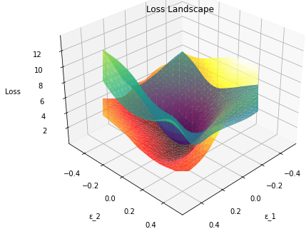

## Introduction
PyHessian은 Deep neural networks의 Hessian information을 빠르게 계산할 수 있는 library 입니다. 
Hessian information은 아래와 같은 요소들을 이야기하며, 이를 활용해 loss landscape 시각화하는 등 NNs를 분석하는 데 사용할 수 있습니다.

- Top Hessian eigenvalues
- The trace of the Hessian matrix
- The full Hessian Eigenvalues Spectral Density (ESD)

## Visualization
PyHessian을 이용해 2D loss landscape를 시각화하는 것에 대한 설명은 저자의 github에 자세히 나와있지만, 
3D 시각화 방법에 대한 자세한 설명이 없기에 설명 및 코드를 공유합니다.

- [블로그](https://cocoa-t.tistory.com/23)
- [Visualize the loss landscape(3D)](./Loss_Landscape_3D_Visualization.ipynb)
- [Compare two models](./3D_Visualization_TwoModels.ipynb)

PyHessian에 대해 더 알고 싶으시면 저자의 [github](https://github.com/amirgholami/PyHessian) 및 논문을 참고해주시기 바랍니다

- [The Hessian tutorial notebook](./Hessian_Tutorial.ipynb)
- [Video explanation of tutorial](https://www.youtube.com/watch?v=S87ancnZ0MM&feature=youtu.be&t=43m20s)
- [The PyHessian paper](https://arxiv.org/pdf/1912.07145.pdf).

